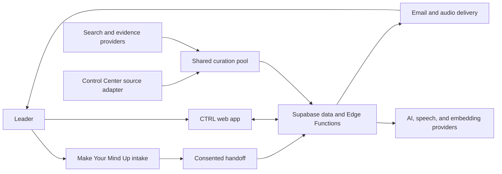

# CTRL architecture

Status: Current
Owner: Mindmaker
Last verified: 2026-08-10 against source at `abd82b21639e9f0948477204f08c671930c2d8c7`

CTRL is a Vite React application on Vercel with Supabase Auth, PostgreSQL, Edge Functions, Storage, Vault, and scheduled jobs. The architecture has one personal context substrate and one curation pool. Product surfaces are views over those shared systems.

## System context



## Runtime components

| Component | Responsibility | Source |
|---|---|---|
| SPA shell | Routing, auth boundary, persistent desktop/mobile chrome, recovery | `src/App.tsx`, `src/router.tsx`, `src/components/layout/` |
| Product surfaces | Today, Decide, Blind Spot, Memory, Briefing, Settings | `src/pages/` |
| Client orchestration | Queries, ranking, playback, memory, decisions, feedback | `src/hooks/`, `src/contexts/`, `src/lib/` |
| Supabase Edge Functions | AI calls, curation, decision evidence, handoff, delivery, billing | `supabase/functions/` |
| PostgreSQL | User context, decisions, curation cache, briefings, delivery claims, audit state | `supabase/migrations/` |
| Scheduled work | Prewarm, delivery, memory, watch, and lifecycle jobs | migrations using Vault, pg_cron, and pg_net |
| Vercel | Static assets, SPA routing, canonical and redirect hosts | `vercel.json` and project configuration |

The repository contains 113 Edge Function directories excluding `_shared`, 78 hook files, and 158 SQL migrations at this verified baseline. These are measured inventory counts, not design targets.

## Frontend boundaries

- `src/router.tsx` is the route authority.
- `AuthedLayoutRoute` owns persistent authenticated chrome.
- `RequireAuth` owns the user boundary for protected routes.
- TanStack Query owns server-state caching. React contexts own cross-surface session state.
- `src/index.css` and the `ctrl-ds` tokens own the product visual system.
- `BrandLockup` owns the product mark. Do not recreate it as text.
- Lazy routes use one recoverable branded loading path and one stale-chunk retry.

The complete current route inventory lives in [features](./features.md) and is checked against `src/router.tsx` during review.

## Data flows

### Intake to First Lens

```text
public answers
  -> validated public function
  -> short-lived portfolio_handoff
  -> auth or email handoff token
  -> resolve-handoff ownership check
  -> verified user_memory facts and preferences
  -> First Lens
```

Public retry paths converge on stable keys. Raw private sentences do not become authenticated facts without the handoff contract.

### Curation to delivery

```text
source gather
  -> AI-native filter
  -> cross-source clustering and scoring
  -> live_headlines_cache shared pool
  -> per-user brain and preference ranking
  -> Today and briefing
  -> email/audio delivery claim
  -> feedback and preference updates
```

Control Center is an optional read-only source adapter inside `live-headlines`. It does not create another feed. Missing bridge configuration fails closed.

### Decision engine

```text
decision
  -> AI-native reframe
  -> typed claims
  -> live evidence retrieval
  -> claim adjudication
  -> tensions and advice
  -> optional Edge Pro model panel
  -> watch and outcome history
```

Evidence and model opinion remain distinguishable. The final call belongs to the leader.

### Memory and Blind Spot

```text
explicit fact or correction
  -> validation and ownership
  -> user_memory plus memory_events lineage
  -> shared brain accessor
  -> ranking, briefing, decisions, export

independent user facts
  -> tentative Blind Spot candidate
  -> evidence re-grounding on confirmation
  -> confirmed pattern only after user approval
```

## Core data ownership

| Concern | Representative tables | Write rule |
|---|---|---|
| Identity and context | `profiles`, `user_memory`, `memory_events`, `user_memory_settings` | Owner-scoped or service-mediated |
| Decisions | `decision_cases`, `decision_claims`, `decision_evidence`, `decision_tensions`, `decision_events`, `decision_outcomes` | Authenticated owner |
| Curation | `live_headlines_cache`, `personal_pool_cache`, `news_preferences`, `briefing_interests` | Shared cache plus owner-scoped preference data |
| Briefing | `briefings`, `briefing_feedback`, `user_briefing_directives` | Authenticated owner; delivery is server-mediated |
| Public handoff and delivery | `portfolio_handoff`, `delivery_subscriptions`, `leader_notification_prefs` | Validated, consented, idempotent contracts |
| Billing | `edge_subscriptions` and Stripe event records | Server and signed webhook only |

All schema truth comes from migrations plus production readback. A table list in prose is illustrative unless a check maintains it.

## AI and external-provider routing

Provider routing is capability-specific. There is no truthful single sentence such as “Vertex primary, OpenAI fallback” for the whole product.

| Capability | Current code path |
|---|---|
| Onboarding result and Blind Spot | OpenAI first, Gemini fallback through `_shared/llm-fallback.ts` |
| Briefing script and curation | OpenAI chat-completions execution, default `gpt-4o-mini`; model selection metadata may be benchmark-assisted |
| Briefing conversation | OpenAI `gpt-4o-mini`, grounded only in the briefing and authorised context |
| Decision reasoning | Anthropic Claude first, OpenAI GPT-4o fallback |
| Decision claim adjudication | OpenAI `gpt-4o-mini` |
| Edge Pro cross-examination | Available panel members from Claude, GPT-4o, Gemini, and Grok; failures are dropped, not fabricated |
| Voice transcription | OpenAI transcription first, Gemini fallback |
| Briefing speech | ElevenLabs |
| Embeddings | OpenAI `text-embedding-3-small` |
| Legacy/general AI generation | Function-specific routing; inspect the called function before making a provider claim |

Search and evidence paths use a bounded mix of Perplexity, Tavily, Brave, Jina, NewsAPI.org, Exa, Artificial Analysis, RSS, GDELT, and Hacker News. Provider availability must degrade honestly.

## Trust boundaries

- Browser code receives only publishable Supabase credentials.
- Service-role and provider credentials remain Edge Function secrets.
- RLS is the default data boundary; service-role functions must independently establish user ownership.
- `supabase/config.toml` is the function JWT contract. A `verify_jwt=false` function must validate a webhook signature, cron secret, service role, or deliberately public bounded input in its handler.
- Stripe webhooks are signature-verified and idempotent.
- Cron calls use the Vault-backed `CTRL_CRON_SECRET`, not a database service-role setting.
- Public inputs validate size and shape, rate-limit costly paths, and converge on retry.
- Logs must not contain secrets or unbounded private content.

## Deployment shape

- Vercel is Git-connected to `main` and serves the SPA.
- Supabase functions deploy independently from frontend releases.
- Production has historical migration-ledger drift. Never apply a blanket production `supabase db push`.
- The safe migration and rollback process lives in the [replication and release guide](../../project-documentation/REPLICATION_GUIDE.md).
- `makeyourmindup.ai` is canonical. The former CTRL host remains a permanent redirect only.

## Architecture invariants

1. One brain accessor, not per-surface context stores.
2. One shared curation pool, not per-channel feeds.
3. Explicit facts, inferred candidates, and behavioral feedback remain different data types.
4. Every user-scoped read and write proves ownership.
5. Retryable writes converge.
6. Provider failure is visible and bounded.
7. Current architecture lives here; release chronology lives in Git and historical records.

## Change triggers

Update this document in the same change when routes, core tables, provider order, auth contracts, cron authentication, curation boundaries, or deployment mechanics change.
